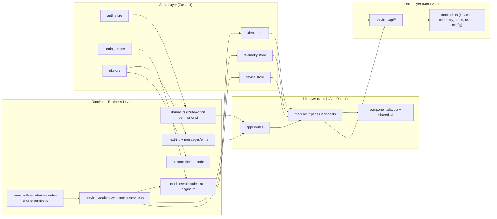
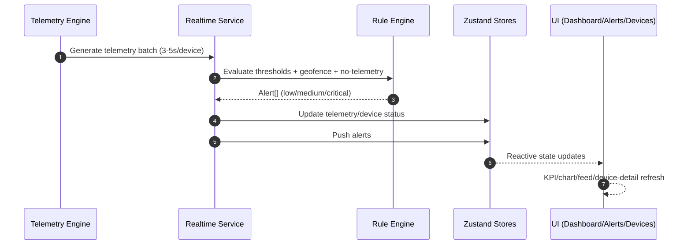

# SentinelOS

SentinelOS is a production-style Industrial Worker Safety Monitoring Platform built with Next.js 14.
It is designed for control-room operations in high-risk environments such as oil and gas facilities,
mining sites, and construction zones.

---

## 1) Project Overview

Industrial teams need a real-time operational view of worker safety signals to reduce response time
and prevent incidents. SentinelOS addresses this by combining live telemetry, rule-based alerting,
device oversight, and role-based operations in a single control-room SaaS experience.

Each worker is represented by a wearable device stream that includes:

- `heartRate`
- `bodyTemperature`
- `activityLevel`
- `battery`
- `signalStrength`
- `latitude` / `longitude`
- `timestamp`

SentinelOS enables teams to:

- monitor worker health in real time
- detect abnormal conditions automatically
- track location and geofence events
- manage incidents with severity-driven workflows

---

## 2) Core Features

- **Control-Room Dashboard**
  - Live KPI cards (workers/devices, active/offline, critical incidents)
  - Real-time chart updates from telemetry stream
  - Compact operational device status view

- **Devices Module**
  - Search and status filtering
  - Device detail with live vitals chart
  - Engineering metrics (uptime %, avg HR 5m, max HR today, battery drain rate)
  - Role-aware controls

- **Alerts Module**
  - Incident feed with severity-first ordering
  - Severity color strips and live badge counters
  - Acknowledge workflow (operator/admin)

- **Role-Based Access Control**
  - Roles: `admin`, `operator`, `viewer`
  - Centralized route and action permissions

- **Telemetry Engine Simulation**
  - Continuous 3–5s telemetry generation
  - Battery drain and signal fluctuation simulation
  - Offline/outage simulation

- **Rule Engine**
  - Threshold-driven risk detection (critical/warning/low)
  - Alert generation pipeline integrated with live UI

- **Map / Geofence**
  - Live worker location visualization (SVG-based control-room map)
  - Geofence boundary and breach highlighting
  - Worker movement trails

- **Analytics**
  - Daily averages and incident frequency
  - Battery trend monitoring with anomaly highlights
  - Worker uptime statistics and comparative views
  - Mock CSV export

- **Platform Experience**
  - Dark / light themes
  - English / Persian i18n

---

## 3) Architecture

SentinelOS uses a modular, scalable structure:

```text
app/
modules/
services/
store/
types/
components/
lib/
```

### Layer Responsibilities

- **UI Layer**: `app`, `modules`, `components`
- **Business Logic Layer**: `modules/rules`, `lib/rbac.ts`
- **Telemetry Engine**: `services/telemetry`
- **Real-Time Orchestration**: `services/realtime`
- **API Layer (mocked)**: `services/api`
- **State Management**: `store` (Zustand)
- **Domain Models**: `types`

### Real-Time Data Flow

```text
Telemetry Engine -> Rule Engine -> Store -> UI
```

1. Telemetry is generated in `services/telemetry/telemetry-engine.service.ts`
2. Rules are evaluated in `modules/rules/alert-rule-engine.ts`
3. Alerts and runtime state are written into Zustand stores
4. UI modules react immediately to store updates

### Access Control

- Route and action authorization is centralized in `lib/rbac.ts`
- Permissions are enforced across dashboard, alerts, devices, and settings workflows

### Architecture Diagram





---

## 4) Technical Stack

- **Framework**: Next.js 14 (App Router)
- **Language**: TypeScript
- **State Management**: Zustand
- **Charts**: Recharts
- **Mapping**: SVG control-room map (Mapbox-ready structure)
- **Styling**: TailwindCSS
- **Internationalization**: next-intl

---

## 5) Installation & Running

### Clone

```bash
git clone <your-repository-url>
cd sentinelos
```

### Install dependencies

```bash
npm install
```

### Run development server

```bash
npm run dev
```

Open:

- `http://localhost:3000` (or selected dev port)

---

## 6) Demo / Screenshots

Add visual assets here for presentation readiness:

- `docs/screenshot/dashboard-live.png` - Dashboard live KPI and chart updates
- `docs/screenshot/device-detail.png` - Device detail engineering metrics and vitals chart
- `docs/screenshot/alerts-feed.png` - Live incident feed with severity ordering
- `docs/screenshot/map-geofence.png` - Geofence boundary and breach visualization

Optional GIFs:

- `docs/gifs/live-telemetry-flow.gif`
- `docs/gifs/alerts-acknowledgement.gif`

---

## 7) Notes

- Current platform behavior uses a **mock backend and simulated telemetry** to represent production-like flows:
  - telemetry stream
  - alert creation
  - device registration
  - role management interactions
- The codebase is organized for production evolution:
  - strong typing
  - modular responsibilities
  - centralized access control
  - clean separation between UI, data, and operational engines

SentinelOS is structured to feel like an operational control-room SaaS, not a generic dashboard prototype.
